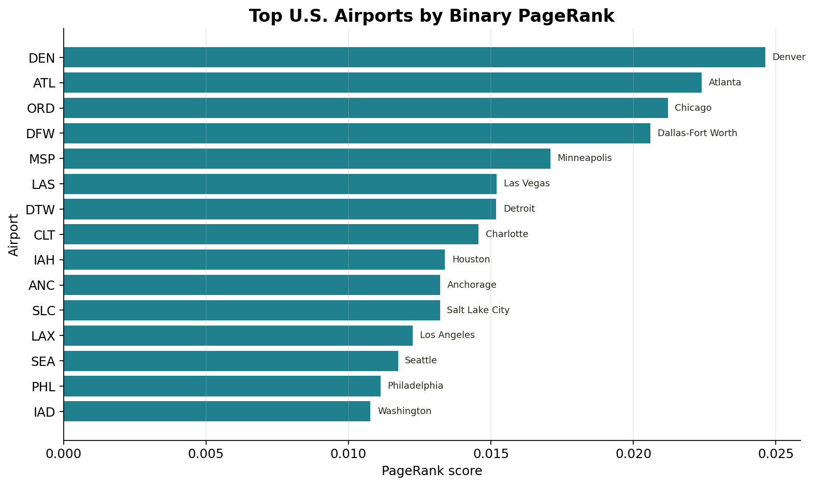
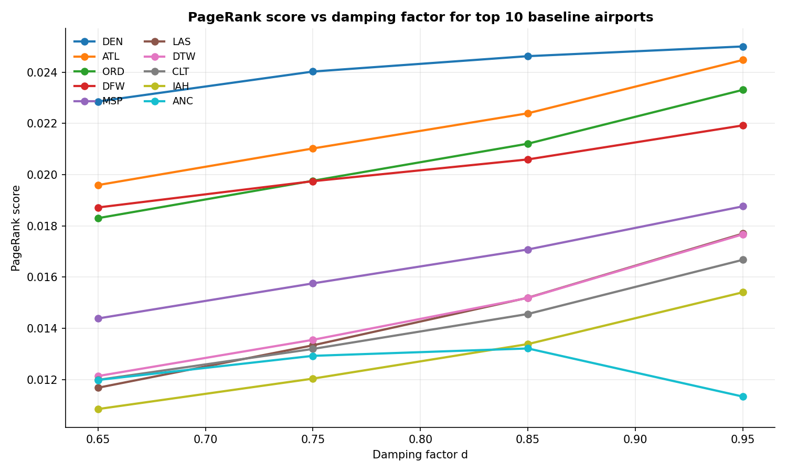
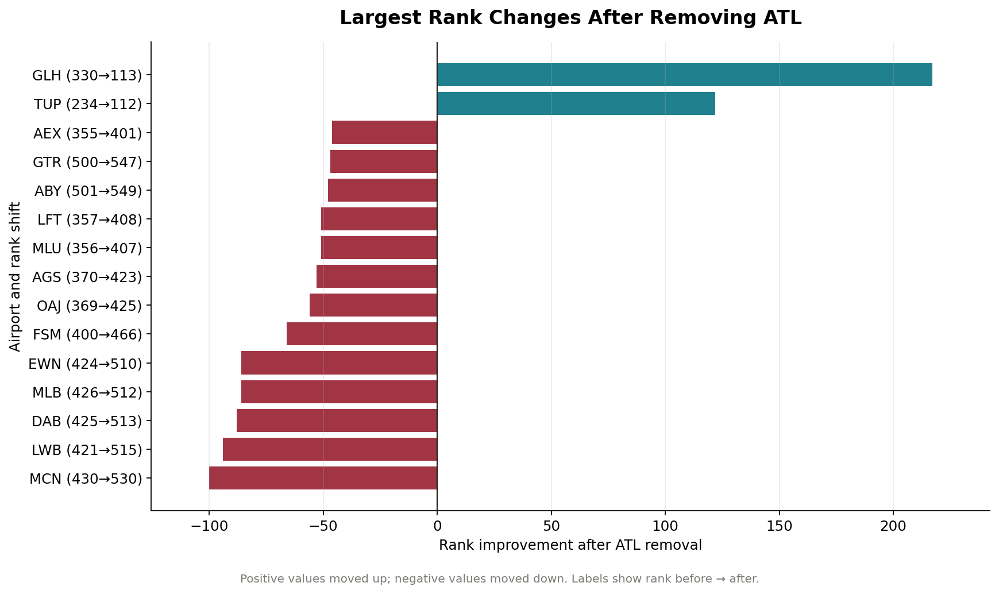

# Airport PageRank

**Using the PageRank Algorithm to Identify Critical Airports in the U.S. Flight Network**

Course project for Applied Linear Algebra.

Team: Mindeok Seo, Jake Gust, Jeewan Khadka, Yijia Zhang, Alan Tang.

## Overview

This project applies the PageRank algorithm to the U.S. airport route network to identify airports that are structurally most important. Airports are modeled as nodes and direct flight routes as directed edges. PageRank assigns a higher score to airports that receive routes from other important airports, so it captures recursive structural importance instead of a plain count of direct routes.

The project answers two questions:

1. **Which U.S. airports are most central by network structure?**
2. **How does the network respond when a major hub (ATL) is removed?**

A damping-factor sensitivity analysis is also included to verify that the ranking is a property of the network rather than an artifact of the standard choice `d = 0.85`.

## Methodology

The pipeline is the standard PageRank construction.

1. **Directed graph.** Each airport is a node. Each direct route is a directed edge `source → destination`.
2. **Adjacency matrix.** `A[i, j] = 1` if there is a direct route from airport `j` to airport `i`, and `0` otherwise. Columns are departure airports, rows are arrival airports.
3. **Transition matrix.** Each column of `A` is normalized so that columns sum to `1`. Dangling columns (airports with no outgoing routes) are replaced with the uniform distribution `1/N`.
4. **Google Matrix.** `G = dM + (1 − d)(1/N)ee^T` with damping factor `d = 0.85`. With probability `d` a traveler follows an actual route; with probability `1 − d` the traveler teleports uniformly.
5. **Power iteration.** Starting from the uniform vector, iterate `v_{k+1} = Gv_k` until `‖v_{k+1} − v_k‖_1 < 10^{-10}`. The converged vector is the principal eigenvector of `G` and gives the PageRank score of each airport.

## Data

The project uses the OpenFlights datasets in `data/`:

- `airports.dat` — airport metadata (IATA code, city, country, latitude, longitude)
- `routes.dat` — directional flight routes between airports

The data is filtered to U.S. airports with valid IATA codes and direct routes whose source and destination are both U.S. airports.

OpenFlights route data is historical, so the results should be read as a demonstration of the method rather than a current operational ranking.

## Network statistics

| Metric | Value |
|---|---:|
| Airports in network | 549 |
| Directed route edges | 5,450 |
| Adjacency matrix size | 549 × 549 |
| Dangling airports | 7 |
| Damping factor | 0.85 |
| Convergence tolerance | 1e-10 |
| Baseline iterations | 112 |

## Key results

### Baseline ranking

The top 10 airports by binary PageRank are:

| Rank | Airport | City | PageRank |
|---:|---|---|---:|
| 1 | DEN | Denver | 0.024626 |
| 2 | ATL | Atlanta | 0.022397 |
| 3 | ORD | Chicago | 0.021209 |
| 4 | DFW | Dallas-Fort Worth | 0.020595 |
| 5 | MSP | Minneapolis | 0.017080 |
| 6 | LAS | Las Vegas | 0.015197 |
| 7 | DTW | Detroit | 0.015189 |
| 8 | CLT | Charlotte | 0.014562 |
| 9 | IAH | Houston | 0.013387 |
| 10 | ANC | Anchorage | 0.013216 |

DEN ranks first even though ATL has the highest total degree, because PageRank weights connections by the importance of the source airport.



### Damping-factor sensitivity

The baseline uses `d = 0.85`, the standard value from the original PageRank paper. To check that the result is not an artifact of that choice, PageRank is recomputed at `d = 0.65, 0.75, 0.85, 0.95`.

- DEN, ATL, ORD, and DFW remain the top four for every damping factor in the range. ORD and DFW only swap once at `d = 0.65`, where their scores are within `0.0004`.
- Spearman rank correlation against the baseline ranking stays above `0.988` across all 549 airports.
- The top-10 set overlaps in 9 of 10 airports at every damping factor.
- Iterations to converge rise from `43` at `d = 0.65` to `353` at `d = 0.95`, consistent with the convergence rate being governed by the second-largest eigenvalue, which approaches `1` as `d → 1`.

The top hubs are stable across the whole range, so the baseline ranking is a property of the U.S. route network rather than of the modeling parameter `d = 0.85`.



### Hub-closure simulation

Removing ATL by deleting all its incoming and outgoing routes leaves `5,145` directed edges. After recomputing PageRank:

- DEN remains the top-ranked airport.
- ORD, DFW, MSP, DTW, CLT, LAS, and IAH absorb most of the importance previously associated with ATL.
- Some smaller regional airports lose a meaningful pathway and drop in PageRank score.

The network does not collapse: the U.S. system has a distributed hub structure, with national-level resilience but local-level vulnerability for airports whose connectivity depended on ATL.



## Repository structure

```
.
├── README.md                          Project landing page (this file)
├── DISCUSSION.md                      Full written discussion of methods and results
├── airport_pagerank_notebook.ipynb    End-to-end analysis notebook
├── scripts/
│   └── sensitivity.py                 Damping-factor sensitivity script
├── data/
│   ├── airports.dat                   OpenFlights airport metadata
│   └── routes.dat                     OpenFlights route records
├── figures/
│   ├── top-airports-pagerank.png
│   ├── atl-removal-rank-changes.png
│   ├── atl-removal-rank-changes-slide.png
│   └── damping-factor-sensitivity.png
├── Airport_PageRank_Presentation.pptx Class presentation deck
├── Airport_PageRank_Presentation.pdf  PDF export of the deck
├── create_presentation.js             Script that builds the pptx deck
├── requirements.txt                   Python dependencies
├── package.json                       Node dependencies for the deck script
└── package-lock.json
```

## How to run

Install Python dependencies and open the notebook:

```bash
python -m pip install -r requirements.txt
jupyter notebook airport_pagerank_notebook.ipynb
```

Run the standalone damping-factor sensitivity script:

```bash
python scripts/sensitivity.py
```

This regenerates `figures/damping-factor-sensitivity.png` and writes `outputs/damping_sensitivity.csv`.

Rebuild the presentation deck (optional):

```bash
npm install
node create_presentation.js
```

## Generated outputs

Running the notebook produces:

- `outputs/baseline_airport_pagerank.csv`
- `outputs/hub_closure_ATL_comparison.csv`
- `outputs/damping_sensitivity.csv`
- `outputs/top_airports_pagerank.png`
- `outputs/hub_closure_ATL_rank_changes.png`
- `outputs/airport_network_sample.png`

## Deliverables

- `README.md` — project landing page
- `DISCUSSION.md` — full written discussion of methodology, baseline results, damping-factor sensitivity, and hub-closure analysis
- `airport_pagerank_notebook.ipynb` — reproducible end-to-end analysis
- `scripts/sensitivity.py` — standalone damping-factor sensitivity analysis
- `figures/` — figures used in the discussion and the presentation
- `Airport_PageRank_Presentation.pptx` and `Airport_PageRank_Presentation.pdf` — class presentation

## Limitations

- OpenFlights route data is historical.
- The adjacency matrix is binary; it does not encode flight frequency, passenger volume, or seat capacity.
- Each outgoing route from an airport is treated as equally likely.
- The hub-closure simulation removes ATL completely rather than partially.

## Possible extensions

- Use BTS T-100 data to weight edges by passenger volume or flight frequency.
- Compare PageRank with degree, betweenness, and eigenvector centrality.
- Run hub-closure simulations for several airports.
- Map centrality shifts geographically using airport latitude and longitude.
